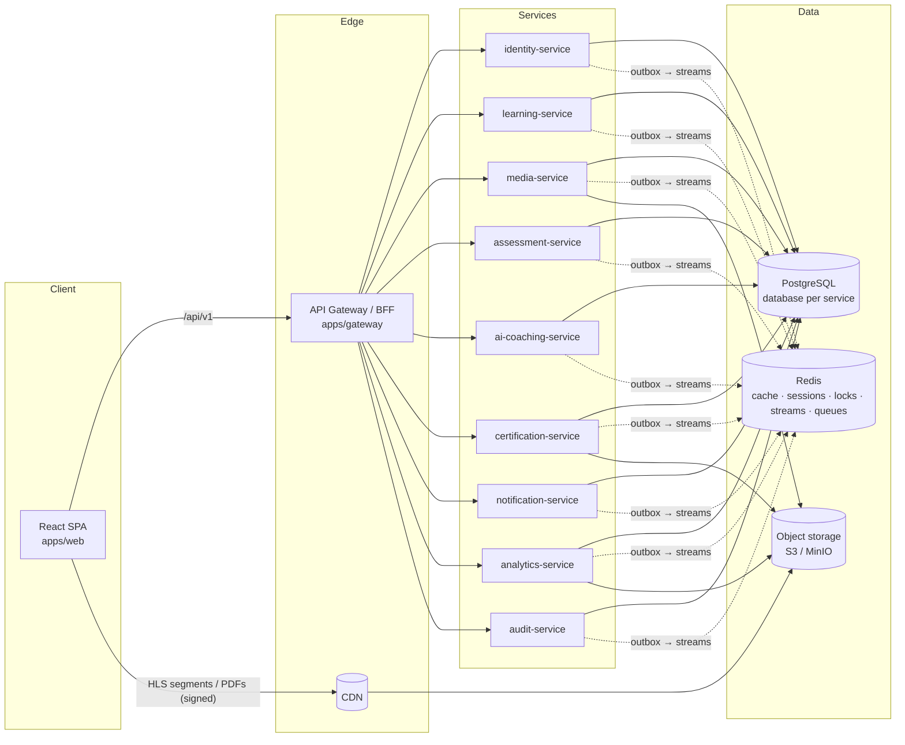
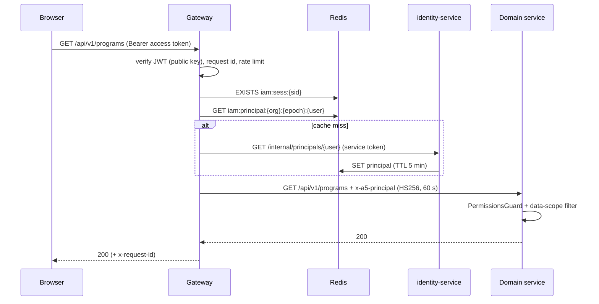
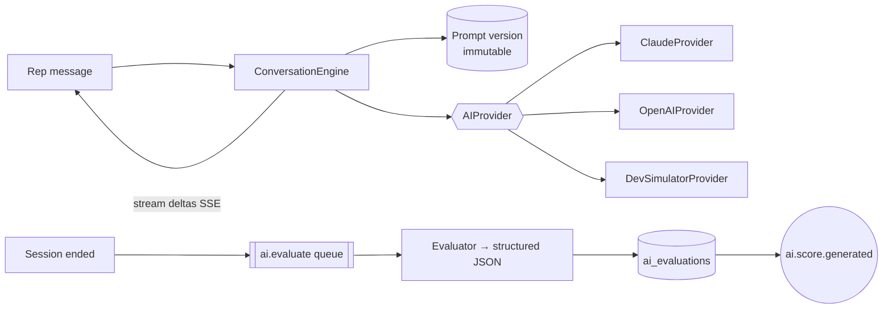
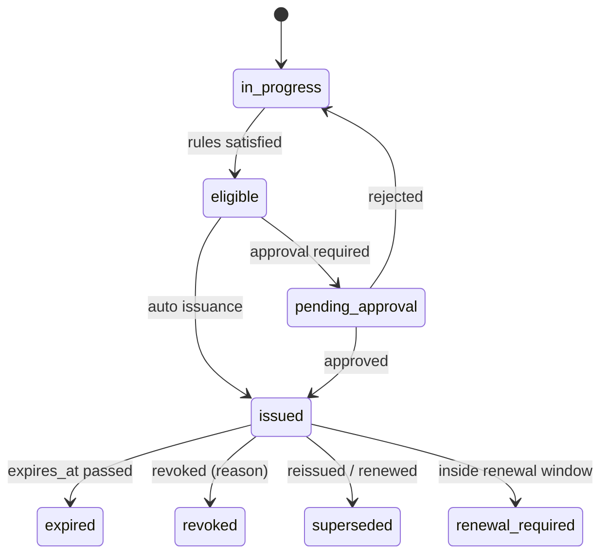

# A5 Roofing Sales Academy — Architecture

Status: living document. Last reviewed with Phase 1 implementation.

This document is the engineering contract for the platform. When code and this
document disagree, fix one of them in the same change.

---

## 1. Product scope in one paragraph

A5 Roofing Sales Academy is an internal sales-enablement platform: onboarding
programs, video/article/document lessons, assessments, an AI homeowner
role-play trainer, certification with verifiable certificates, manager
oversight and reporting. The first program is the four-week _A5 New Hire Sales
Academy_, but nothing in the data model or the code assumes four weeks, one
program, one certification or one location. Every business threshold (quiz
pass mark, watch percentage, AI score, expiry, number of simulations, approval
requirements) is data, editable by an administrator.

---

## 2. System architecture



### 2.1 Runtime topology

| Deployable              | Port | Database           | Owns                                                                                |
| ----------------------- | ---- | ------------------ | ----------------------------------------------------------------------------------- |
| `apps/web`              | 5173 | —                  | SPA (static assets, served by CDN in production)                                    |
| `apps/gateway`          | 4000 | — (Redis only)     | Public HTTP entry point, authN, principal resolution, rate limits, BFF              |
| `identity-service`      | 4010 | `a5_identity`      | Users, sessions, credentials, RBAC, org hierarchy, settings, feature flags          |
| `learning-service`      | 4020 | `a5_learning`      | Programs, structure, enrollment, progress, unlock rules                             |
| `media-service`         | 4030 | `a5_media`         | Media assets, uploads, processing, playback authorization, watch telemetry          |
| `assessment-service`    | 4040 | `a5_assessment`    | Question banks, assessments, attempts, grading                                      |
| `ai-coaching-service`   | 4050 | `a5_ai`            | Personas, scenarios, prompt versions, conversations, evaluations                    |
| `certification-service` | 4060 | `a5_certification` | Certifications, eligibility, templates, signatories, stamps, issuance, verification |
| `notification-service`  | 4070 | `a5_notification`  | In-app notifications, email, templates, rules, real-time stream                     |
| `analytics-service`     | 4080 | `a5_analytics`     | Event-fed facts, rollups, dashboards, reports & exports                             |
| `audit-service`         | 4090 | `a5_audit`         | Immutable audit log                                                                 |

Every service runs in one of three roles chosen by `SERVICE_ROLE`:

- `api` – HTTP only,
- `worker` – outbox relay, event consumers, BullMQ processors, schedulers,
- `all` – both (local development default).

Production scales API and worker replicas independently. All processes are
stateless; state lives in PostgreSQL, Redis and object storage.

### 2.2 Why these service boundaries

Boundaries follow ownership of data and rate of change, not technical layers.

- **Identity and Organization/RBAC are one service.** The spec lists them
  separately; we deliberately merged them. Creating a user, assigning roles
  and placing them in a team is one administrative operation that must be
  atomic, and the principal (permissions + data scope) is derived from all
  three. Splitting them would introduce a distributed transaction on the most
  common admin action and a synchronous hop on every request. Inside the
  service, `auth`, `users`, `access` (RBAC) and `organization` are separate
  Nest modules with no cross-module repository access, so extraction stays
  possible.
- **Media is separate from Learning.** Upload, processing and playback have a
  completely different load profile (large binary flows, ffmpeg workers,
  high-frequency telemetry) from the course catalogue.
- **Certification is separate from Learning and Assessment.** It has its own
  lifecycle (issue, revoke, expire, renew), its own legal/audit requirements
  and consumes facts from three other services.
- **Notification, Analytics and Audit** are pure event consumers with their
  own read models; they never block a write path.
- **Not split further:** e.g. "question bank service" vs "attempt service", or
  "template service" vs "issuance service". Those share transactions and would
  be chatty.

### 2.3 Communication rules

1. Browser → Gateway only (`/api/v1/*`). The browser never knows service URLs.
   Exceptions: signed object-storage/CDN URLs for media and PDFs.
2. Gateway → service: HTTP with a short-lived **internal principal token**.
3. Service → service **writes**: never synchronous. Use domain events.
4. Service → service **reads**: preferred via local projections built from
   events (e.g. the people directory). Synchronous reads are allowed through
   `/internal/*` endpoints with a service token when a fresh value is needed at
   a decision point (e.g. certificate snapshot reading the recipient's legal
   name from identity).
5. Capabilities across services use **signed grants** instead of calls
   (learning issues a _lesson grant_ that media, assessment and AI verify).

---

## 3. Monorepo layout

```
apps/
  web/                    React + Vite SPA
  gateway/                API gateway / BFF (NestJS)
  identity-service/
  learning-service/
  media-service/
  assessment-service/
  ai-coaching-service/
  certification-service/
  notification-service/
  analytics-service/
  audit-service/
packages/
  config/                 Env schema helpers, fail-fast loading
  contracts/              Zod API contracts shared by web and services (isomorphic)
  events/                 Versioned domain event schemas + catalog (isomorphic)
  permissions/            Permission catalog, default roles, scope helpers (isomorphic)
  rules/                  Rule-tree schema, evaluator, describer (isomorphic)
  observability/          Logger, request context, tracing bootstrap
  database/               Kysely factory, migrator, transactions, outbox/inbox SQL
  messaging/              Redis Streams publisher/consumer, outbox relay, BullMQ helpers
  auth/                   Token minting/verification, Principal, data-scope helpers
  storage/                Object storage abstraction (S3, local disk), signing
  nest-kit/               Nest modules: bootstrap, validation, errors, guards, health, cache, locks
  directory/              People-directory projection (tables, consumer, scope SQL)
  seed-data/              Deterministic A5 seed dataset shared by every service seed
  testing/                Test DB/Redis harness, token factories, fixtures
docs/
infra/                    docker, compose, init SQL
```

- Package manager: **pnpm workspaces**; task runner: **Turborepo**.
- Language: TypeScript 6 (strict) everywhere. ESM everywhere (NestJS 12 is ESM).
- Isomorphic packages expose an `@a5/source` export condition so Vite and
  Vitest consume TypeScript sources directly, while Node consumes `dist`.

---

## 4. Database model

PostgreSQL 16, **one database per service** on a shared cluster in development
(separate clusters/instances are a deployment decision, not a code change).
A service never connects to another service's database.

Conventions:

- `uuid` primary keys generated in the application as **UUIDv7** (time-ordered,
  index friendly). Sequence numbers exist only where humans need them
  (certificate numbers, attempt numbers).
- `created_at`, `updated_at` (`timestamptz`), `created_by`, `updated_by` on
  mutable aggregates.
- `organization_id` on every tenant-owned aggregate root; every query filters
  by it.
- Soft state transitions (`status`, `archived_at`) instead of deletes for
  anything with history. Hard deletes only for drafts with no references.
- Immutable tables (attempt snapshots, AI messages, certificate snapshots,
  audit logs, prompt versions, template versions) are insert-only; the audit
  table additionally has triggers that reject `UPDATE`/`DELETE`.
- JSONB for _versioned configuration documents_ validated by Zod schemas
  (lesson config, rule trees, template designs). Relational columns for
  everything queried, filtered or joined.
- Migrations: Kysely migrations (`up`/`down`) in each service
  `src/database/migrations`. Never auto-sync.

### 4.1 Entity map (by service)

**identity** — `organizations`, `locations`, `departments`, `teams`,
`team_members`, `team_managers`, `users`, `user_relationships`
(manager/trainer → user), `credentials`, `sessions`, `refresh_tokens`,
`login_attempts`, `one_time_tokens` (activation, reset, email verification),
`mfa_factors`, `permissions` (synced from code catalog), `roles`,
`role_permissions`, `user_roles`, `organization_settings`, `feature_flags`,
`outbox_events`.

**learning** — `programs`, `program_audiences`, `program_prerequisites`,
`program_phases` (the spec's _sections_: "Week", "Phase", … label is
configurable), `program_modules`, `lessons`, `lesson_resources`,
`program_versions` (published snapshots), `enrollments`, `lesson_progress`,
`lesson_notes`, `approval_requests`, `acknowledgments`,
`learner_assessment_scores` and `learner_ai_scores` (projections),
directory projection, `outbox_events`, `inbox_events`.

**media** — `media_assets`, `media_renditions`, `media_captions`,
`media_chapters`, `media_transcripts`, `video_progress`, `outbox_events`.

**assessment** — `question_banks`, `question_categories`, `competencies`,
`questions`, `question_versions` (immutable), `assessments`,
`assessment_items` (fixed question or pool rule), `attempts`,
`attempt_questions` (drawn snapshot), `attempt_answers`, `score_overrides`,
directory projection, outbox/inbox.

**ai** — `ai_personas`, `ai_rubrics`, `ai_rubric_versions`, `ai_scenarios`,
`ai_prompt_versions` (immutable), `ai_sessions`, `ai_messages`,
`ai_evaluations`, `ai_evaluation_scores`, `ai_session_reviews`, `ai_usage`,
`ai_settings`, directory projection, outbox/inbox.

**certification** — `certification_definitions`, `certification_programs`,
`certification_signatory_slots`, `certificate_templates`,
`certificate_template_versions` (immutable), `signatories`,
`signatory_signatures` (versioned images), `signatory_certifications`,
`stamps`, `stamp_certifications`, `certification_candidates`,
`certificate_approvals`, `issued_certificates`, `certificate_snapshots`
(immutable), `certificate_revocations`, `certificate_reissues`,
`certificate_renewals`, `certificate_reminders`,
`certificate_number_sequences`, `certificate_events`, fact projections
(`learner_program_status`, `learner_assessment_results`, `learner_ai_results`,
`program_assessments`), directory projection, outbox/inbox.

**notification** — `notification_templates`, `notification_rules`,
`notifications`, `email_deliveries`, `notification_preferences`, directory
projection, inbox.

**analytics** — `fact_enrollments`, `fact_lesson_completions`,
`fact_assessment_attempts`, `fact_question_results`, `fact_ai_sessions`,
`fact_certificates`, `daily_rollups`, `report_jobs`, directory projection,
inbox.

**audit** — `audit_logs` (range-partitioned by month), inbox.

### 4.2 Index strategy (query-pattern driven)

| Query                                 | Index                                                                                       |
| ------------------------------------- | ------------------------------------------------------------------------------------------- |
| Login by email                        | `users (organization_id, lower(email))` unique                                              |
| Session validation fallback           | `sessions (id) where revoked_at is null`                                                    |
| Refresh token lookup                  | `refresh_tokens (token_hash)` unique                                                        |
| "My enrollments"                      | `enrollments (user_id, status)`                                                             |
| Team progress (manager)               | `enrollments (program_id, status)` + directory `team_members (team_id, user_id)`            |
| Learner outline                       | `lesson_progress (enrollment_id, lesson_id)` unique                                         |
| Attempts per learner/assessment       | `attempts (assessment_id, user_id, attempt_number)` unique                                  |
| AI sessions per learner, newest first | `ai_sessions (user_id, started_at desc)`                                                    |
| Certificate lookup                    | `issued_certificates (certificate_number)` unique, `(verification_token)` unique            |
| One active certificate                | `issued_certificates (definition_id, user_id) where status = 'issued'` unique partial       |
| Expiry sweeps                         | `issued_certificates (expires_at) where status = 'issued'`                                  |
| Unpublished outbox                    | `outbox_events (created_at) where published_at is null` partial                             |
| Audit by resource / actor / time      | `audit_logs (resource_type, resource_id, occurred_at desc)`, `(actor_id, occurred_at desc)` |
| Notifications inbox                   | `notifications (user_id, created_at desc)`, partial `where read_at is null`                 |

---

## 5. Identity, sessions and security

### 5.1 Tokens

- **Access token** – JWT, `EdDSA` (Ed25519), 10 minutes, claims
  `sub`, `sid`, `org`, `iss`, `aud`, `exp`. Contains **no permissions** so
  that permission changes apply immediately.
- **Refresh token** – 256-bit opaque value, stored as SHA-256 hash, delivered
  in an `HttpOnly; Secure; SameSite=Strict; Path=/api/v1/auth` cookie.
  Rotated on every use. Re-use of a rotated token revokes the whole session
  (token-theft detection).
- **CSRF** – cookie-authenticated endpoints (`/auth/refresh`, `/auth/logout`)
  require a double-submit token (`a5_csrf` cookie + `X-CSRF-Token` header).
  All other endpoints use the `Authorization` header and are not CSRF-prone.
- **Session revocation** – Redis key `iam:sess:{sid}` (TTL = session expiry)
  is checked by the gateway on every request. Revoking deletes the key and
  marks the DB row; effect is immediate across all gateway replicas.
- **Passwords** – Argon2id. Brute force: per-account and per-IP counters in
  Redis with progressive lockout; gateway rate limits on `/auth/*`.
- **MFA-ready** – `mfa_factors` table and a login state machine
  (`password_ok → mfa_required → session`) are in place; factors are not yet
  enrollable from the UI.

### 5.2 Request path



### 5.3 Principal

```ts
interface Principal {
  userId: string;
  organizationId: string;
  sessionId: string | null;
  roles: string[]; // role keys
  permissions: Record<PermissionKey, DataScope>;
  managedTeamIds: string[]; // teams the user manages
  managedUserIds: string[]; // direct reports / assigned trainees
}
type DataScope = 'own' | 'managed' | 'organization' | 'platform';
```

Services receive the principal as an HS256-signed JWT in `x-a5-principal`
(secret: `INTERNAL_AUTH_SECRET`, audience `a5-internal`, 60 s TTL). Services
reject requests without it except routes decorated `@Public()`.

---

## 6. RBAC model

- **Permissions** are `resource.action` keys defined in code
  (`packages/permissions`) because enforcement is code. Identity syncs the
  catalog into the `permissions` table at startup so the admin matrix can
  render module groupings and descriptions.
- **Roles** are per organization: `is_system` roles are instantiated from code
  defaults when an organization is created; custom roles are created/cloned by
  admins. System roles can be edited and **reset to default**; the
  `super_admin` role is immutable.
- **Data scope** is a property of the role (`own`, `managed`, `organization`,
  `platform`). A user's effective scope for a permission is the widest scope
  among roles granting it.
- **Anti-escalation**: you can only grant permissions you hold, only assign
  roles whose permissions you hold, and cannot modify your own roles.
- **Enforcement**: `@RequirePermissions('users.update')` guard in every
  service + data-scope filtering in queries (`managed` → directory join on
  `managedTeamIds`/`managedUserIds`). Frontend gating is cosmetic only.

Default roles (data scope in brackets):

| Role                   | Scope        | Summary                                                                                 |
| ---------------------- | ------------ | --------------------------------------------------------------------------------------- |
| Super Administrator    | platform     | Everything, including platform settings and organizations                               |
| Administrator          | organization | Users, training, AI, certificates, templates, reports                                   |
| Training Administrator | organization | Programs, lessons, media, assessments, AI scenarios, certifications, training analytics |
| Manager                | managed      | Team progress, scores, coaching, certificates, approvals                                |
| Trainer / Coach        | managed      | Assigned trainees, assessment review, AI session review, feedback                       |
| Sales Representative   | own          | Own training, assessments, AI practice, certificates                                    |
| Auditor / Viewer       | organization | Read-only reporting and audit                                                           |

---

## 7. Domain events

### 7.1 Envelope

```ts
interface EventEnvelope<P> {
  id: string; // UUIDv7, idempotency key
  type: string; // 'certificate.issued'
  version: number; // schema version of payload
  occurredAt: string; // ISO timestamp
  producer: string; // 'certification-service'
  organizationId: string | null;
  actor: { type: 'user' | 'service' | 'system'; id: string | null };
  correlationId: string | null; // originating request id
  causationId: string | null; // event that caused this event
  subject: { type: string; id: string } | null;
  payload: P;
}
```

Schemas live in `packages/events` (Zod), keyed by `type@version`. Producers
may only add optional fields within a version; breaking changes create
`version + 1` and producers dual-publish during migration.

### 7.2 Transport: transactional outbox → Redis Streams

```mermaid
sequenceDiagram
  participant H as HTTP handler
  participant DB as Service DB
  participant W as Outbox relay (worker)
  participant RS as Redis Stream a5.events.<svc>
  participant C as Consumer service
  H->>DB: BEGIN; write aggregate; INSERT outbox_events; NOTIFY outbox; COMMIT
  W->>DB: SELECT … FOR UPDATE SKIP LOCKED (unpublished)
  W->>RS: XADD
  W->>DB: UPDATE published_at
  C->>RS: XREADGROUP (consumer group per service)
  C->>DB: BEGIN; INSERT inbox(event_id, handler) ON CONFLICT DO NOTHING; apply; COMMIT
  C->>RS: XACK
```

- **At-least-once** delivery; **effectively-once** processing through the
  inbox table written in the same transaction as the handler's effects.
- Failed handlers are retried by reclaiming pending entries
  (`XAUTOCLAIM`, idle ≥ 30 s). After `MAX_DELIVERIES` the entry is copied to
  `a5.dlq.<consumer>` with the error and acknowledged. DLQ entries can be
  replayed with `pnpm --filter <svc> events:replay-dlq`.
- Handlers must tolerate reordering: projections carry `version` /
  `occurredAt` guards and use upserts.
- One stream per producer keeps per-producer ordering and lets streams be
  trimmed independently (`MAXLEN ~`).

### 7.3 Background jobs: BullMQ

Expensive or slow work runs in BullMQ queues owned by a service:
`media.process`, `media.progress-flush`, `assessment.notify`, `ai.evaluate`,
`certification.pdf`, `certification.expiry`, `certification.reminders`,
`notification.email`, `analytics.rollup`, `analytics.report`. Policy:
exponential backoff, bounded attempts, completed jobs trimmed, failed jobs
moved to `<queue>.dlq` with the error; idempotent job IDs (e.g.
`pdf:<certificateId>`) so duplicates collapse.

### 7.4 Event catalog (v1)

| Event                                                                                                                                                                                                                                                           | Producer      | Main consumers                                   |
| --------------------------------------------------------------------------------------------------------------------------------------------------------------------------------------------------------------------------------------------------------------- | ------------- | ------------------------------------------------ |
| `user.created`, `user.activated`, `user.deactivated`                                                                                                                                                                                                            | identity      | notification, analytics, audit                   |
| `directory.user.upserted`, `directory.team.upserted`, `directory.unit.upserted`                                                                                                                                                                                 | identity      | every service with a directory projection        |
| `identity.password_reset.requested`, `identity.invitation.created`                                                                                                                                                                                              | identity      | notification                                     |
| `program.published`, `program.archived`                                                                                                                                                                                                                         | learning      | certification, analytics, notification           |
| `program.enrolled`, `enrollment.withdrawn`, `enrollment.overdue`                                                                                                                                                                                                | learning      | notification, analytics, certification           |
| `lesson.started`, `lesson.completed`                                                                                                                                                                                                                            | learning      | analytics                                        |
| `phase.completed` (spec: _week.completed_), `program.completed`                                                                                                                                                                                                 | learning      | certification, analytics, notification           |
| `approval.requested`, `approval.decided`                                                                                                                                                                                                                        | learning      | notification                                     |
| `video.started`, `video.progressed`, `video.completed`                                                                                                                                                                                                          | media         | learning, analytics                              |
| `media.asset.ready`, `media.asset.failed`                                                                                                                                                                                                                       | media         | learning, notification                           |
| `assessment.attempt.started`, `assessment.attempt.submitted`, `assessment.attempt.graded` (spec: _quiz.passed / quiz.failed_ via `passed`)                                                                                                                      | assessment    | learning, certification, analytics, notification |
| `ai.session.started`, `ai.session.completed`, `ai.score.generated`                                                                                                                                                                                              | ai            | learning, certification, analytics, notification |
| `certificate.eligible`, `certificate.approval_requested`, `certificate.issued`, `certificate.generated`, `certificate.downloaded`, `certificate.revoked`, `certificate.reissued`, `certificate.expired`, `certificate.expiring`, `certificate.renewal_required` | certification | notification, analytics                          |
| `audit.recorded`                                                                                                                                                                                                                                                | every service | audit                                            |

---

## 8. Redis strategy

| Use                        | Key pattern                                            | TTL / notes                                                                                |
| -------------------------- | ------------------------------------------------------ | ------------------------------------------------------------------------------------------ |
| Session liveness           | `iam:sess:{sid}`                                       | session absolute expiry                                                                    |
| Principal cache            | `iam:principal:{org}:{epoch}:{userId}`                 | 5 min; `iam:epoch:{org}` bumped on role/permission change, user key deleted on user change |
| Login throttling           | `iam:login:fail:{email}`, `iam:login:ip:{ip}`          | 15 min windows                                                                             |
| Rate limiting              | `rl:{bucket}:{key}:{window}`                           | fixed window, per route class                                                              |
| Program tree               | `lrn:tree:{programId}:{rev}`                           | 10 min, rev bumped on mutation                                                             |
| Catalog / settings / flags | `lrn:catalog:{org}`, `cfg:{svc}:{org}`, `ff:{org}`     | 1–5 min + explicit invalidation                                                            |
| Dashboard summaries        | `anl:dash:{scope-hash}`                                | 60 s (data is already aggregated)                                                          |
| Watch telemetry buffer     | `med:wp:{user}:{asset}:{context}` + `med:wp:dirty` set | write-behind, flushed every 30 s and on milestones                                         |
| Distributed locks          | `lock:{name}`                                          | SET NX PX + token-checked release (Lua)                                                    |
| Real-time fan-out          | pub/sub `rt:user:{id}`                                 | notifications, progress updates                                                            |
| Event bus                  | streams `a5.events.{svc}`, `a5.dlq.{consumer}`         | approximate MAXLEN trimming                                                                |
| Jobs                       | BullMQ `bull:{queue}:*`                                | per-queue retention                                                                        |

Never cached: password hashes, refresh tokens, AI transcripts, assessment
answers, certificate snapshots.

---

## 9. Media strategy

- **Storage abstraction** (`packages/storage`): `S3Storage` (AWS S3, MinIO,
  R2 …) and `LocalDiskStorage` (tests, offline dev). Keys are generated
  (`media/{org}/{assetId}/source`); original file names are display metadata
  only. Buckets are private.
- **Upload**: `POST /media/uploads` validates kind, MIME and size → creates a
  `media_assets` row (`awaiting_upload`) → returns a presigned POST with a
  `content-length-range` condition. Browser uploads directly to storage, then
  calls `POST /media/uploads/{id}/complete`. The service verifies the object
  (HEAD + magic-byte sniff of the first bytes) and enqueues processing.
- **Malware scanning**: `MalwareScanner` interface (`ClamAvScanner` via
  `clamd` INSTREAM, `NoopScanner` for development) runs before an asset can
  become `ready`.
- **Processing** (`media.process` worker): ffprobe → HLS ladder (480p/720p/
  1080p capped at source) with ffmpeg → thumbnail → `ready`. `Transcoder`
  interface allows swapping in a managed service (MediaConvert, Mux).
- **Playback**: learning returns a signed _lesson grant_; media exchanges it
  for a playback descriptor. The master/variant playlists are served by the
  media service (tiny text files) with every segment URL individually signed
  for the storage/CDN, so video bytes always flow **Storage → CDN → Client**.
- **Watch telemetry**: the player records watched intervals (not just
  position) and sends a heartbeat every 15 s (and on pause/end/page hide via
  `sendBeacon`). The server merges intervals in Redis, credits only time that
  was plausibly watched (wall-clock vs. content time, playback-rate cap,
  no credit for seeks), and persists to PostgreSQL write-behind. Crossing a
  5 % boundary emits `video.progressed`; learning compares it to the lesson's
  configured minimum.

---

## 10. Learning engine

- Hierarchy: Program → Phase (label configurable, e.g. "Week") → Module →
  Lesson. Lessons have a `type` handled by a **lesson type registry** on both
  backend (config schema + completion strategy) and frontend (renderer +
  editor). Adding a type = one backend handler + one renderer/editor.
- Lesson types: video, article, pdf, document, external, quiz, assignment,
  ai_simulation, scenario, final_assessment, manager_approval, acknowledgment.
- Navigation mode per program: `sequential` (implicit "previous required
  item complete" rules) or `free`.
- **Unlock rules** are rule trees (`packages/rules`) attached to phases,
  modules and lessons, evaluated against learner facts:
  lesson/module/phase completion, assessment best score, AI scenario best
  score, approvals, dates. Thresholds are rule parameters, never constants.
- Editing model: admins edit the live tree; new or changed nodes are drafts
  until **Publish changes**, which publishes them atomically, writes an
  immutable `program_versions` snapshot and emits `program.published`.
- Progress is denormalised onto `enrollments` (percent, counts, current
  lesson) and updated transactionally with each lesson completion.

---

## 11. Assessment engine

- Question types: multiple choice, multiple select, true/false, short answer,
  long answer, scenario, ordering, matching. Objective types auto-grade;
  open types go to `pending_review` for trainers.
- Questions are versioned; attempts reference `question_versions`, so edits
  never change history. Attempts snapshot assessment configuration, drawn
  questions and option order at start.
- Server-enforced time limits (`expires_at`), attempt limits, cooldowns and
  reveal policies. Answers autosave; submission is idempotent.
- Score overrides are separate records with reason + audit, never an update
  of the original grading.

---

## 12. AI coaching architecture



- `AIProvider` interface: `complete()`, `stream()`, `structured()` with
  usage reporting. Provider and model are per-scenario data, defaulting to
  organization AI settings.
- The homeowner prompt is compiled from persona + scenario (background,
  property context, hidden concern, trigger) and strict role rules: stay in
  character, never coach, never reveal being an AI, reveal the hidden concern
  only after genuine discovery, end with a machine-readable end marker.
- Every scenario change produces a new immutable `ai_prompt_versions` row
  (prompts, persona snapshot, model, settings, rubric version). Sessions and
  evaluations reference the version they ran under.
- Scoring is asynchronous; the evaluator returns category scores (0–100),
  strengths, missed opportunities, questions the rep should have asked, risky
  statements, recommended responses and a next goal — each grounded in quoted
  turns of the transcript.
- **Voice-ready**: the engine is transport-agnostic
  (`handleTurn(input: {text?, audio?})`), messages carry `modality` and an
  optional audio reference, and `SpeechToTextProvider` /
  `TextToSpeechProvider` interfaces sit at the edges. Adding voice is adding
  providers and a WebSocket transport, not changing the engine.
- Token usage and estimated cost are recorded per call in `ai_usage`.

---

## 13. Certification architecture



- **Eligibility** is a rule tree on the definition (program completion,
  required lessons, assessment thresholds per program, final exam, minimum AI
  sessions, AI average, specific scenarios passed, approvals, acknowledgment,
  other certifications). Facts come from local projections fed by learning,
  assessment and AI events, so evaluation is fast and does not depend on other
  services being up. Each evaluation stores a per-requirement breakdown that
  powers "6 / 8 requirements complete".
- **Issuance** (single transaction under a Redis lock
  `lock:cert:{definition}:{user}`, backed by a partial unique index):
  allocate number (`UPDATE certificate_number_sequences … RETURNING`),
  insert certificate, write immutable snapshot (recipient, dates, template
  version design, signatory names/titles, **copied** signature and stamp
  images), create verification token, write outbox events (`certificate.issued`,
  `audit.recorded`). The PDF job (`pdf:{certificateId}`) runs after commit; a
  sweeper re-enqueues certificates stuck in `pdf_status = pending`.
- **Templates** are structured designs (page, theme, positioned elements bound
  to placeholders) validated by Zod. The same design renders as HTML for live
  preview and as PDF (PDFKit) in the worker. Template edits create new
  immutable versions.
- **Numbering**: per-definition pattern such as
  `{ORG}-{CODE}-{YYYY}-{SEQ:6}` → `A5-SALES-2026-000184`; sequences only grow.
- **Verification**: `/verify/{token}` shows status, name, certification,
  issuer, dates and number only.
- Reissue, revoke, expire and renew always create new records and keep the
  originals.

---

## 14. Frontend architecture

- React 19, Vite, React Router (data router, lazy route modules per feature),
  TanStack Query for server state, Zustand only for client state (auth
  session, UI preferences), React Hook Form + shared Zod contracts, Radix
  primitives, Tailwind CSS v4 with semantic design tokens.
- `src/features/<domain>` own their routes, API hooks, components and tests.
  `src/components` holds design-system primitives only.
- API client: single `fetch` wrapper — access token in memory, single-flight
  refresh on 401, `x-request-id`, normalized `ApiError` with actionable
  messages.
- Query keys are factories per feature (`learningKeys.outline(id)`); mutations
  invalidate precise keys; optimistic updates only for idempotent toggles
  (notification read, notes).
- Real-time: one authenticated SSE stream (`/api/v1/notifications/stream`)
  pushes notification and progress events which update the query cache.

### 14.1 Design system

Semantic tokens (`background`, `surface`, `surface-elevated`, `text-primary`,
`text-secondary`, `border`, `brand-primary`, `brand-secondary`, `success`,
`warning`, `danger`, `information`) are CSS custom properties mapped into
Tailwind. Placeholder brand: _charcoal_ primary with a _copper_ accent — a
nod to roof flashing — replaceable in one file when A5 brand assets arrive.
Typography: IBM Plex Sans / IBM Plex Mono (self-hosted), 13–14 px UI text,
20–24 px page titles. Hierarchy comes from type and spacing, not boxes.

---

## 15. Security plan

| Concern        | Control                                                                                                              |
| -------------- | -------------------------------------------------------------------------------------------------------------------- |
| AuthN          | Ed25519 JWT access tokens, rotating refresh tokens, revocable sessions                                               |
| AuthZ          | Permission guards + data-scope query filters in every service; gateway never the only check                          |
| Escalation     | Grant-only-what-you-hold, immutable super admin, self-role edits blocked                                             |
| Input          | Zod validation on every body/query/param; unknown keys stripped                                                      |
| Output         | Response DTO mapping; no DB rows returned directly                                                                   |
| Transport      | Helmet headers, strict CORS allow-list, HSTS in production                                                           |
| Abuse          | Redis rate limits per route class, login throttling, upload size limits                                              |
| Files          | Type allow-list, magic-byte sniffing, generated keys, private buckets, signed URLs, scanning hook, no SVG for images |
| Secrets        | Env-only, validated at boot, never logged (logger redaction)                                                         |
| Audit          | Outbox-backed audit events for every sensitive mutation                                                              |
| Public surface | Verification endpoint returns an allow-listed DTO; tokens are 192-bit random                                         |
| AI             | Prompts never include other users' data; transcripts visible only to owner, trainers/managers in scope               |

---

## 16. Observability

- `pino` JSON logs with `service`, `requestId`, `userId`, `route`,
  `durationMs`, `status`; secrets redacted.
- `x-request-id` generated at the gateway (or accepted from a trusted proxy),
  propagated to services, events (`correlationId`) and jobs.
- OpenTelemetry SDK bootstrap (`OTEL_EXPORTER_OTLP_ENDPOINT` enables export).
- `/health/live` (process) and `/health/ready` (PostgreSQL, Redis, storage
  where relevant) on every service.

---

## 17. Development phases

1. Architecture, repository, shared packages, database conventions, identity,
   RBAC, org hierarchy, gateway, design system, application shell.
2. Learning engine, media, enrollment, progress, program builder, player.
3. Assessment engine, question bank, quizzes, unlock rules.
4. AI objection trainer: scenarios, conversation engine, evaluation, coaching.
5. Certification: requirements, templates, signatures/stamps, issuance, PDF,
   verification, approvals, revocation, renewals.
6. Notifications, analytics, reports, dashboards.
7. Hardening: security review, performance, E2E, accessibility, deployment.

Each phase ends with lint, typecheck, tests and builds green.

### 17.1 Implementation status

Phases 1–6 are implemented end to end (services, migrations, seeds, contracts, web UI). Phase 7 is
in progress: Playwright journeys exist for identity, assessment, AI coach, certification,
analytics/audit and content admin; a security review and an accessibility pass are tracked in the
README's known limitations.

The entity map in §4.1 is the design baseline. Each service's `migrations/` directory is the
source of truth; the analytics, notification and audit services in particular grew a few tables
beyond this list (report jobs and exports, delivery logs, audit partitions).

Deliberate deviations from the plan: the dashboard funnel is derived from KPIs because analytics
does not expose true stage transitions; voice practice is interface-only; media uploads are not
resumable; there is no standalone feature-flag API (flags are an organization setting).

---

## 18. Architecture decision log

| #      | Decision                                         | Reason                                                                                           |
| ------ | ------------------------------------------------ | ------------------------------------------------------------------------------------------------ |
| ADR-1  | Identity + Org/RBAC in one service               | Atomic user/role/team operations; principal derivation in one place                              |
| ADR-2  | Database per service                             | Enforced data ownership; independent migrations                                                  |
| ADR-3  | Kysely + SQL migrations instead of an ORM        | Explicit SQL, typed queries, reversible migrations, no runtime engine                            |
| ADR-4  | Redis Streams for domain events, BullMQ for jobs | One infrastructure dependency; consumer groups give fan-out; BullMQ gives retries/backoff/delays |
| ADR-5  | Transactional outbox + inbox                     | No lost or duplicated effects when DB and bus disagree                                           |
| ADR-6  | Permissions not in access tokens                 | Revocation takes effect immediately                                                              |
| ADR-7  | Zod contracts shared by web and services         | One validation source; OpenAPI generated from the same schemas                                   |
| ADR-8  | Signed lesson grants                             | Media/assessment/AI authorize lesson-bound actions without a synchronous call                    |
| ADR-9  | Structured certificate designer, PDFKit renderer | Predictable layouts, identical preview and PDF geometry, no headless browser in workers          |
| ADR-10 | Live-edit + publish snapshots for programs       | Simple admin model with auditable history; avoids per-learner version pinning in V1              |
| ADR-11 | TypeScript 6                                     | TS 7 (native) lacks the compiler API used by typescript-eslint and Nest tooling                  |
